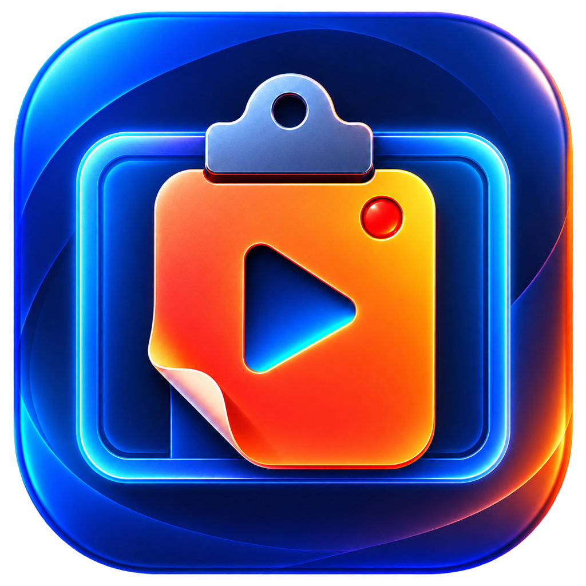

# ScreenContext

**Show your AI what you mean.**

ScreenContext records your screen, voice, and clicks, then turns them into paste-ready context for AI agents. Record a demonstration, explain what matters, and copy the recording context into your AI workflow.

ScreenContext is a native macOS 15+ screen-recording app written in Swift 6. It captures a selected display or window with ScreenCaptureKit, optionally mixes system audio, microphone audio, and a draggable webcam overlay, and stores an MP4 plus PNG keyframes for the first frame, every click, and the final frame.

Completed recordings, click keyframes, and the recording-history catalog are kept together in ScreenContext's sandboxed Application Support directory. The result window shows each recording's timestamp, provides compact previous/next controls for moving through that persisted history, and can delete a recording with its keyframes after confirmation.

The app deliberately keeps capture focused: there is no separate studio preview, fixed output-aspect preset, live-stream publishing, browser runtime, or external media process. When a window is selected, the webcam positioning preview follows that window and stays within its bounds.

Open `ScreenContext.xcodeproj` and run the shared `ScreenContext` scheme with Command-R. Xcode owns the app bundle, resources, privacy descriptions, entitlements, signing, launch, and debugger workflow.

Build from the repository root using Xcode 26 or later with the macOS 26 SDK. The app runs on macOS 15 or later; on-device transcription requires macOS 26 and an available speech model for the selected language. Screen recording, microphone, and camera access are requested as needed. There is no App Store download published by this repository yet.

To enable product analytics in a local build, create `Configuration/Analytics.local.xcconfig` with `POSTHOG_PROJECT_TOKEN = phc_...`. The local file is ignored by Git. Builds without a token use the no-op analytics client and log a warning. Analytics are anonymous, default on, and can be disabled under General → Share usage analytics; the disclosure there notes that recording-context template names and contents are included.

For CLI or Codex automation, `./script/build_and_run.sh` is a thin wrapper around `xcodebuild`. Its supported modes remain `--debug`, `--logs`, `--telemetry`, and `--verify`; derived data is stored under `.build/xcode`.

Run the fast unit suite with `./script/test_unit.sh`. The long media-pipeline regression is intentionally isolated in a nested Swift package; run it separately with `./script/test_integration.sh`. A plain `swift test` from this directory runs only the unit suite. Keep `./script/check_native_only.sh` as the independent repository-policy check that rejects JavaScript, web views, Electron, FFmpeg, and other non-native runtime artifacts.

### Known validation limitation

During the ScreenContext rename, all 105 unit tests and the Xcode build, signing, and launch checks passed. The synthetic long-recording integration test failed during finalization with `LocalRecordingError.failedToFinish(nil)`. The same failure reproduced against untouched pre-rename code on the same Mac. Long-recording finalization still needs investigation; the integration suite is not currently a passing release check on that environment.

## Upgrading from ContextCast

The executable, Xcode project, Swift modules, interface, and icon now use ScreenContext. The bundle identifier `de.marcusschiesser.contextcast`, existing Application Support directory, and preference keys intentionally retain their original values so existing recordings, templates, and settings remain accessible. New recordings use the ScreenContext filename prefix; the library also reads older ContextCast filenames. macOS permission behavior can still depend on code signing when building locally.

## Contributing and integrations

Bug reports, focused pull requests, and integration ideas are welcome through [GitHub issues](https://github.com/marcusschiesser/screencontext/issues). Read [design.md](design.md) before changing the interface and run the unit suite and native-only check before submitting a change. For team workflows or paid customization, open an issue describing the integration without including private recordings or credentials.

## License

ScreenContext is licensed under [Apache-2.0](LICENSE). See [NOTICE](NOTICE) and [third-party notices](THIRD_PARTY_NOTICES.md) for attribution. The license does not grant rights to the ScreenContext name or third-party trademarks.
