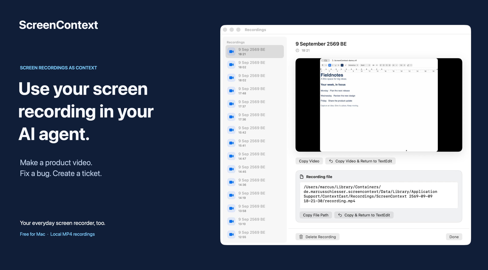

# ScreenContext

**Use your screen recording in your AI agent.**

ScreenContext captures a screen recording and sends it as context to your AI agent. The agent can use that context to make a product video, fix a bug, or create a ticket.

[](https://apps.apple.com/app/id6809044710)

[Mac App Store](https://apps.apple.com/app/id6809044710) · Free · macOS 15+

## From your screen to your agent

1. **Choose your inputs.** Open Settings → Recordings. Select a screen or window, then choose whether to include system audio, microphone audio, and a webcam overlay.
2. **Capture the context.** With your agent's app active, press **⌃⌘R** to start. Record a product walkthrough, reproduce a bug, or capture a workflow. Press the shortcut again to stop.
3. **Bring the recording back.** The recording opens automatically for review. Click **Copy & Return to [App]**, or press **⌘⇧C**, to copy its reference and switch back to your agent's app. Press **⌘V** there to paste.
4. **Give the agent a task.** Add your request alongside the recording: “Fix the bug I demonstrated,” “Create a Linear issue,” or “Turn this walkthrough into a product presentation video.”

Use an agent that can process video. The copied context is just the local MP4 path:

```text
/path/to/your/recording.mp4
```

A local path works only if your agent can access that file. If it cannot, attach the MP4 using the agent's file-upload controls. ScreenContext does not upload or attach the recording automatically.

Copy & Return remembers the app that was active when recording started. It is available for recordings made during the current ScreenContext session. 

## Your everyday screen recorder, too

ScreenContext also works as a normal screen recorder, so you don't need to install a second app for everyday recordings. Capture a tutorial, share a walkthrough with a teammate, or save a quick demo—no AI agent required.

Recordings are saved as local MP4 files. Revisit them in the recording library with playback, Copy Video, and deletion controls.

To share the video in an app such as Slack, start recording with that app active. Use **Copy Video & Return to [App]** below the player, or press **⌘⌥⇧C**, then press **⌘V** in the destination app to paste the video file.

Customize the global shortcut at the top of Settings → Recordings. Recording status and elapsed time stay in the menu bar while you work.

## Local by default

No ScreenContext account, cloud upload, or analytics. ScreenContext requests screen recording, microphone, and camera access when needed. Choose the app language in Settings → General, which also contains Privacy Policy and Support.

[Privacy policy](docs/privacy.md) · [Support](docs/support.md) · [Report an issue](https://github.com/marcusschiesser/screencontext/issues)

## Build and test

Open `ScreenContext.xcodeproj` in Xcode 26 or later, select the ScreenContext scheme, and choose your signing team. Or run:

```sh
./script/build_and_run.sh
```

Run the checks:

```sh
./script/test_unit.sh
./script/test_integration.sh
./script/check_native_only.sh
```

The audio-output test requires access to the macOS AAC encoder. Restricted execution environments report a capability skip; run the scripts outside that restriction to validate actual media encoding.

The app uses Swift, SwiftUI, ScreenCaptureKit, and native macOS media APIs. See [design.md](design.md) for interface guidance.

## License

[Apache-2.0](LICENSE). See [NOTICE](NOTICE) and [third-party notices](THIRD_PARTY_NOTICES.md). The license does not grant rights to the ScreenContext name or third-party trademarks.
